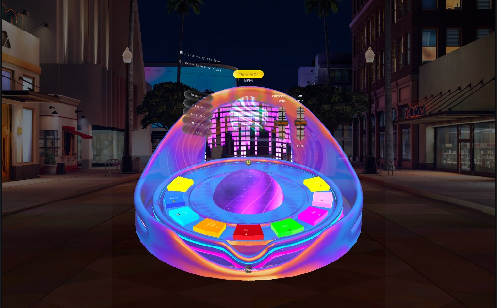

# 🎛️ MiNiMIDI v3

> **Crash-safe AI DJ for Snap Spectacles** — Generate stems with Google Lyria, crossfade live in AR, mix with your hands. *Lyria is a trademark of Google LLC.*

[](https://lensstudio.snapchat.com/)
[](https://www.spectacles.com/)
[](https://www.typescriptlang.org/)
[](LICENSE)

<p align="center">
  
</p>

---

## 🎬 Demo

<p align="center">
  
  <br><br>
  <a href="YOUR_DEMO_LINK_HERE">
    
  </a>
</p>

*https://www.reddit.com/r/Spectacles/s/fmYjZjFbZg*

---

## ✨ What is MiNiMIDI v3?

MiNiMIDI v3 is an **AI music studio for Snap Spectacles** that lets you generate, layer, and crossfade live stems in augmented reality — all with your hands.

Tap a pad. Google Lyria generates a fresh loop. Grab the fader. Mix two decks together in real time. No crashes. No gaps. No pre-recorded samples.

```
Tap pad  →  Lyria generates stem  →  Crossfade live  →  Mix in AR
```

v3 solves a hard Spectacles problem: **live crossfading multi‑MB PCM audio without overrunning script time or memory** — using native engine gain where possible and a serialized audio pump so two decks never blast the device in a single frame.

---

## 🆕 What's New in v3

### 🔥 Crash-Safe Crossfader — built for Spectacles AI music

Large AI-generated stems (multi‑MB PCM, long loops) made the DJ crossfader unsafe on Spectacles. Every mix change was re-encoding the full buffer in TypeScript and re-pumping `DynamicAudioOutput` — sometimes twice in one frame (Deck A + Deck B). That blew memory, overran script time, and crashed as soon as the fader moved.

**v3 fixes this end-to-end.** Here's how:

---

#### 1 · Native Per-Layer Gain

```
Before:  fader move → multiply entire PCM buffer in JS → pump DynamicAudioOutput
After:   fader move → AudioComponent.volume (engine-side, no JS buffer walk)
```

`AudioLayerManager` discovers an `AudioComponent` on the same pad hierarchy as each `DynamicAudioOutput` (same object → child named `DynamicAudioOutput` → shallow search). When found:

- `addAudioFrame` receives unity-level PCM — no per-fader buffer multiply in JavaScript
- Volume is applied by the Spectacles audio engine via `AudioComponent.volume`
- Layers without a component log at startup and fall back to legacy PCM scale (so you always know which slots need wiring)

---

#### 2 · Serialized Native Pumps

```
Before:  slide end → two full-buffer applies fire in the same tick → memory spike
After:   queue → at most one interrupt + addAudioFrame per frame
```

`applyLayerVolumeNow` no longer does heavy work synchronously when two decks update at once. Updates are queued; the manager drains at most one per frame so a fader release never stacks two buffer operations in a single tick.

---

#### 3 · Debounced Slider Volume

```
Before:  every slider event → PCM work
After:   debounced window + minimum delta threshold → redundant events skipped
```

`setLayerVolume` uses a longer debounce window with a minimum-delta guard. Tiny changes vs the last committed level are skipped entirely on the debounced path.

---

#### 4 · Hardened Crossfader Controller

```
Before:  assumed slider range 0–1 → wrong volumes on non-default SIK sliders
After:   displayTo01() maps using slider's own min/max
```

`CrossfaderController` reads the SIK slider's actual `min`/`max`. During drag: time throttle + minimum delta + optional quantize steps cut the event rate. Deck layers are resolved with `AudioLayerManager.getLayerForOwner()` — volume always targets the right layer even if a pad's cached index is stale.

---

#### 5 · Lifecycle Hygiene

```
Before:  released layers could receive a delayed pump → ghost audio / corruption
After:   immediate volume queue cleared on release, play, and replace
```

Immediate volume queues are cleared on `releaseLayer`, `playOnLayer`, and `replaceLayerPcmAndReplay`. Released or replaced layers cannot receive a delayed pump.

---

### 🎚️ Auto-Generated UI — No Manual Wiring

v3 generates all pads and stem controls at runtime from a single config. No more assigning dozens of Inspector slots by hand.

---

### 🌈 Spectrum Visualizer

A real-time per-stem frequency ring visualizes the mix as it happens — bar heights and colours shift with the audio energy of each active layer.

---

## 🚀 Features

| Feature | Description |
|---------|-------------|
| 🎚️ **Live Crossfader** | Blend two AI decks — crash-safe on Spectacles |
| 🎹 **Auto-Generated Pads** | All stems built at runtime, no Inspector wiring |
| 🤖 **AI Stem Generation** | Unique loops via Google Lyria on demand |
| 🌈 **Spectrum Visualizer** | Real-time frequency ring per active stem |
| 🔊 **Native Gain Path** | Engine-side volume — zero PCM work in JS |
| ⚡ **Serialized Pumps** | Max one buffer op per frame, no tick overruns |
| 👐 **Hand-Controlled** | Mix entirely through Spectacles hand tracking |
| 🔄 **Smart Layer Pool** | **9** pooled `DynamicAudioOutput` channels with lifecycle hygiene |

---

## 🎼 Genres

| Genre | BPM | Vibe |
|-------|-----|------|
| 🎧 Electronic | 128 | Club, EDM, Synths |
| 🎤 Hip Hop | 90 | Trap, 808s, Beats |
| 🎷 Lo-fi Jazz | 75 | Chill, Relaxed, Smooth |
| 🏠 House | 124 | Disco, Funky, Groovy |
| 🎸 Rock | 120 | Guitar, Drums, Energy |

---

## 🛠️ Quick Start

### Prerequisites

- [Lens Studio 5.x](https://lensstudio.snapchat.com/download/)
- [Snap Spectacles (2024)](https://www.spectacles.com/)
- Google Cloud API access for Lyria (configure credentials per your Lens / backend setup — do not commit secrets)

### Installation

```bash
git clone https://github.com/urbanpeppermint/MiniMIDI-v3.git
cd MiniMIDI-v3
# Open the .esproj file in Lens Studio
```

### Verify native gain path after deploy

In Lens Studio / device logs, look for a line like:

```text
[AudioLayerManager] Ready 9/9 layers — **native gain** on all (crossfader does not rescale PCM)
```

Search for **`native gain on all`** if the exact count differs.

If instead you see **`native gain on [ … ] only`** with **`PCM scale`**, add or wire an **`AudioComponent`** on those pad roots so the crossfader stays on the native gain path.

### Project capabilities

Enable **Internet Access** (and any other capabilities your Lyria integration requires) in **Project Settings** so generation and remote calls succeed on device.

---

## 🎮 How to Use

| Step | Action |
|------|--------|
| 1️⃣ | **SELECT GENRE** — tap a genre button |
| 2️⃣ | **WAIT FOR AI** — Lyria generates unique stems |
| 3️⃣ | **TAP PADS** — toggle stems on / off |
| 4️⃣ | **CROSSFADE** — grab the fader, blend two decks live |
| 5️⃣ | **SWITCH GENRE** — cached stems load instantly |

---

## 🔬 Technical Depth

### Why the old crossfader crashed

```
Deck A fader change:   read buffer → scale all samples in JS → pump DynamicAudioOutput
Deck B fader change:   (same frame) → read buffer → scale → pump again
                                                              ↑
                                              script time overrun + memory spike = crash
```

Large AI stems are often **2–6+ MB** of raw PCM. Multiplying that twice in one TypeScript tick on Spectacles hardware is enough to blow the frame budget.

### How v3 stays stable

```typescript
// Old path (dangerous on huge buffers)
for (let i = 0; i < pcm.length; i += 2) {
  let s = pcm[i] | (pcm[i+1] << 8);
  if (s > 32767) s -= 65536;
  s = Math.round(s * volume);           // full buffer × every fader event
  s = Math.max(-32768, Math.min(32767, s));
  out[i]   = s & 0xFF;
  out[i+1] = (s >> 8) & 0xFF;
}

// New path (native gain — no buffer walk)
audioComponent.volume = targetLevel;    // engine applies gain in hardware
```

### Layer lifecycle state machine

```
IDLE → playOnLayer()  → PLAYING
PLAYING → releaseLayer() → IDLE         (queue cleared)
PLAYING → replaceLayerPcmAndReplay() → PLAYING  (queue cleared, new PCM)
PLAYING → fader event → enqueue → drain one per frame
```

---

## 📊 Performance

| Metric | Earlier Lyria builds | v3 |
|--------|---------------------|-----|
| Crossfade safety | ❌ crashes on large stems | ✅ stable |
| Volume path | PCM multiply in JS | Engine-side gain (when `AudioComponent` present) |
| Buffer ops per frame | Unbounded | Max 1 |
| UI wiring | Manual per-pad | Auto-generated |
| Visualizer | Dot pool | Spectrum ring |
| Audio channels | — | **9** (pooled) |
| Sample rate | 48 kHz | 48 kHz |

---

## 🏗️ Architecture

```
MiNiMIDI v3
├── AudioLayerManager        Native gain discovery + serialized pump queue
├── CrossfaderController       SIK slider → displayTo01() → getLayerForOwner()
├── DJMidiManager              Lyria, pads, genre/BPM coordination
├── MIDIControllerMenu         Genre + stem confirm flow
├── MidiPadController          Per-pad PCM, playback, visuals
├── SpectrumRingReaction       Ring layout + reaction
├── SpectrumPinchNavigator     Pinch → sector / overlay
├── SpectrumThereminVoice      Looped theremin bus (AudioComponent crossfade)
└── MiniMidiAudioSpectacleAdapter   Spectrum ↔ pad audio port
```

---

## 🔗 Built On

<p align="center">
  <a href="https://github.com/urbanpeppermint/MiNiMIDI_LYRIA">
    
  </a>
</p>

v3 is a ground-up rewrite of the **audio engine** from MiNiMIDI LYRIA, retaining the Lyria AI integration and genre system while replacing the unsafe PCM crossfader with native gain control, serialized pumps, and hardened SIK handling.

---

## 📄 License

MIT License — see [LICENSE](LICENSE)

---

<p align="center">
  <strong>Built with 💜 for Snap Spectacles</strong>
  <br><br>
  <sub>by <a href="https://github.com/urbanpeppermint">@urbanpeppermint</a></sub>
</p>
